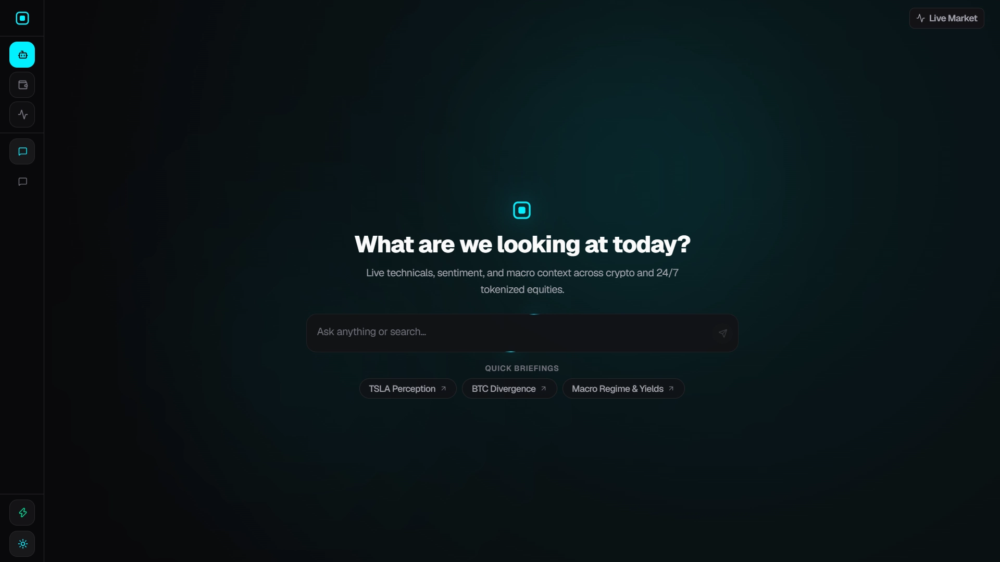
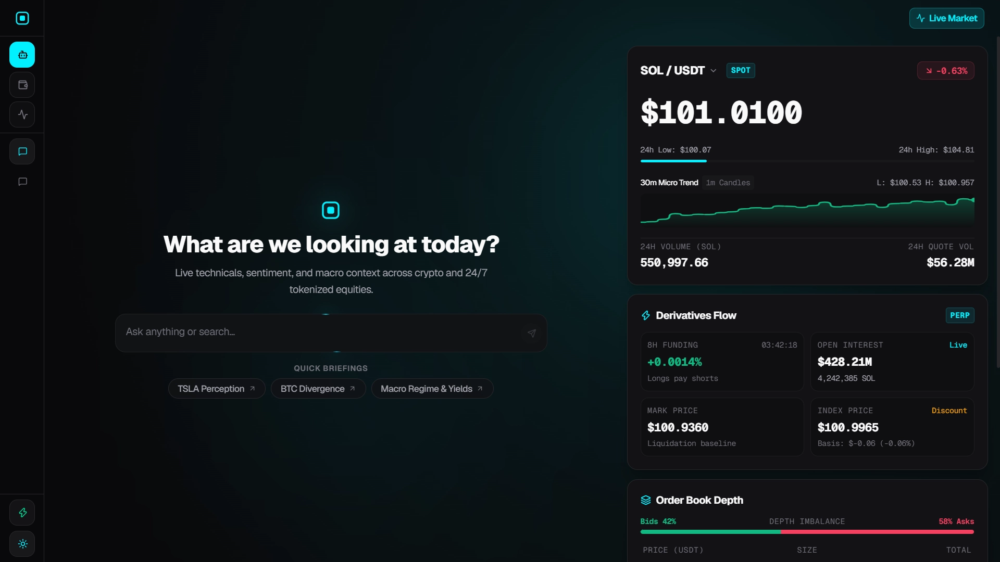
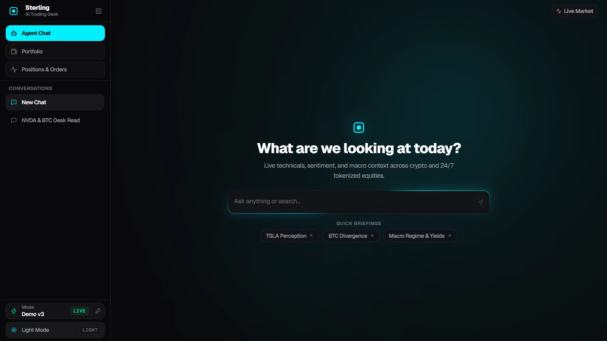
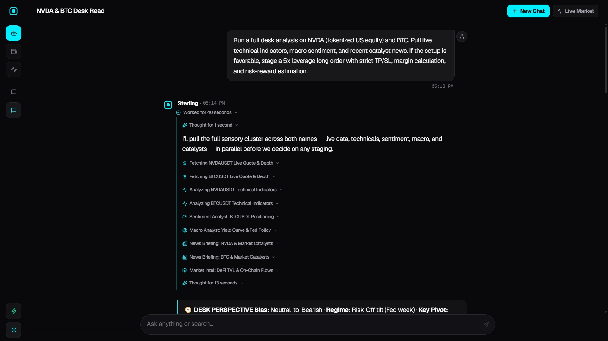
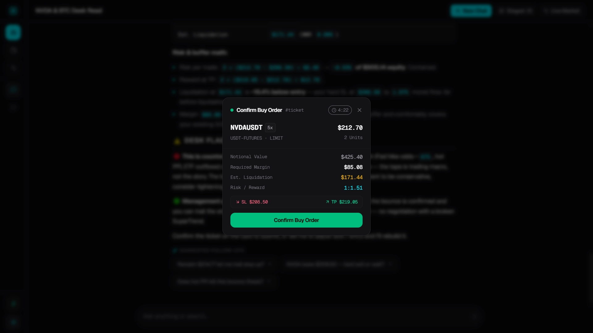
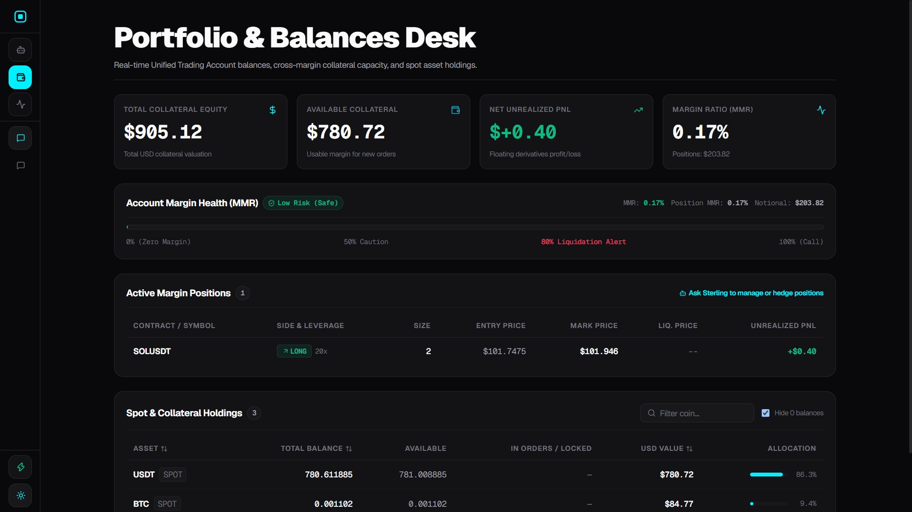
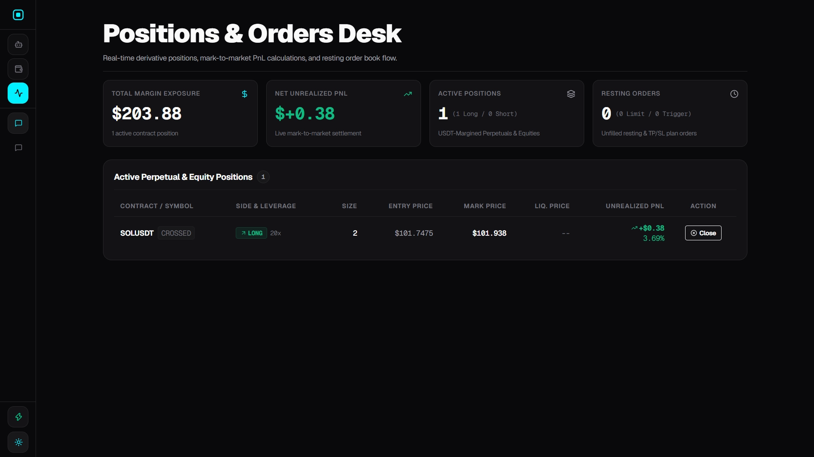

# Sterling — Institutional AI Trading Desk & Cross-Asset Intelligence Workbench

<p align="left">
  
  
  
  
  
  
  
  
</p>

Traditional markets have opening bells and closing bells, but tokenized US stocks (rTokens) never shut down. Macro events break over the weekend while prices keep moving on-chain — turning the global trading window into a 24/7 landscape.

Most trading setups force a painful trade-off: either juggling a dozen noisy terminal windows, or chatting with generic AI bots that hallucinate stale data. 

**Sterling bridges this gap.** Built on Next.js 16, Bun, and Bitget Unified Trading Account (UTA v3), Sterling is a high-conviction AI trading desk and research workbench. It pairs live market perception and quantitative sensory tools with cryptographic execution safety — giving traders a calm, capable partner right at the desk.

---

## A Visual Tour of the Desk

### 1. The Modern Trading Stage
A focused, distraction-free environment built for institutional clarity. Jump straight into cross-asset research, explore macro catalysts, or begin structuring trades with zero friction.



---

### 2. Sub-50ms Live Market Streamer
Slide out the real-time market drawer to monitor live Level-2 order books, tick-by-tick depth, 24-hour volume, open interest, and funding rate skews. Multiplexes crypto perpetuals alongside tokenized spot equities (`RNVDA`, `RTSLA`, `RAAPL`) over a single high-performance WebSocket.



---

### 3. Specialized Research & Navigation
Easily switch between historical intelligence sessions, portfolio overviews, and dedicated 24/7 research tools — including the **Premarket Gap Gauge**, **Weekend Event Monitor**, and **RToken Basis Ticker**.



---

### 4. Deep AI Desk Perspective
Sterling evaluates markets like an experienced senior analyst. It queries technical indicators, macro yield curves, and neural news catalysts simultaneously to deliver clear probabilistic scenarios, pivot levels, and invalidation points.



---

### 5. Cryptographic Staged Execution (Human-in-the-Loop)
Sterling never places blind orders. Instead, it constructs a cryptographically signed HMAC trade ticket with exact tick-precision snapping, required margin, estimated liquidation levels, and risk/reward ratios. You review the terms on an interactive modal before a single satoshi hits the exchange.



---

### 6. Unified Portfolio & Margin Balances
Stay grounded with real-time Unified Trading Account (UTA v3) visibility. Inspect total equity, available margin, maintenance margin health (MMR%), and multi-currency collateral allocations with zero guesswork.



---

### 7. Active Position Management & Order Flow
Monitor live open positions across Hedge and One-Way modes. Inspect unrealized PnL in real time, review working limit and trigger orders, and execute partial de-risking or emergency market exits with a single click.



---

## How It Works (The Trader's Workflow)

```
1. Conversational Query   "Analyze NVDAUSDT tokenized futures with RSI, 4h EMAs, and recent catalysts."
         │
         ▼
2. Multi-Tool Dispatch    Sterling queries live market data, technical indicators, and news in parallel.
         │
         ▼
3. Desk Perspective       Renders bias, key price pivots, quantitative tables, and invalidation levels.
         │
         ▼
4. Staged Action Ticket   "Looks solid. Stage a 5x long order for 2 units with a 2% stop loss."
         │
         ▼
5. Trader Confirmation    Trader reviews the risk ladder in the modal and clicks [Confirm Order] on Bitget UTA v3.
```

---

## Technical Architecture & Capabilities

### The 12 Sensory Domain Tools
Powered by Vercel AI SDK v7 with Fireworks AI and Bitget AI models, Sterling's reasoning engine coordinates 12 specialized tools:

| Tool | Category | Analytical Capability |
| :--- | :--- | :--- |
| **`market_data`** | Live Pricing | Real-time Bitget V3 spot and perpetual tickers, funding rates, open interest, and L2 depth. |
| **`technical_analysis`** | Quantitative | Multi-timeframe trend structure, 20/50/200 EMAs, RSI 14, MACD histograms, Bollinger Bands, and Fibonacci levels. |
| **`macro_analyst`** | Macro Regime | 10Y-2Y Treasury yield spreads, Fed target rate outlook, CPI/PCE inflation, DXY, and cross-asset correlations. |
| **`sentiment_analyst`** | Crowd & Flow | Fear & Greed index, Top-Trader vs Retail Long/Short ratios, and short squeeze risk alerts. |
| **`market_intel`** | On-Chain / DeFi | Multi-chain TVL rankings (ETH, SOL, Base, Arbitrum), stablecoin liquidity, and gas metrics. |
| **`news_briefing`** | Neural Intel | Exa AI neural search (`bitget-signal` standard): breaking headlines, ETF flows, and protocol catalysts. |
| **`web_search`** | Deep Search | Semantic web search for regulatory filings, exchange announcements, and governance proposals. |
| **`stage_trade_order`** | Execution | Validates exchange constraints, snaps tick/step sizes, calculates margin/liquidation, and generates HMAC tickets. |
| **`get_account_overview`** | Portfolio | Real-time UTA equity balance, available margin, maintenance margin ratio (MMR%), and active positions. |
| **`get_open_orders`** | Order Flow | Working orders across Spot and Futures with hedge-mode flags and trigger detection. |
| **`cancel_order`** | Order Flow | HMAC-signed cancellation ticket for specific orders or symbol-wide cancellations. |
| **`close_position`** | Risk Management | Stages emergency or target market close (full or partial % de-risk) via reduce-only order. |

---

### Engineering Highlights

* **Sub-50ms WebSocket Architecture:** Multiplexes L2 order book deltas, ticker ticks, and 1-minute candle feeds with `requestAnimationFrame` render throttling.
* **Pure TypeScript Quant Suite:** Zero-dependency mathematical calculations for RSI, MACD, Bollinger Bands, SuperTrend, and Fibonacci zones directly in runtime.
* **Cryptographic HMAC Signing:** Staged tickets are signed with a 5-minute TTL token (`base64url(payload).expiresAt.signature`) to eliminate parameter tampering.
* **Local-First Dexie IndexedDB:** Chat history, reasoning steps, tool telemetry, and staged tickets persist client-side in IndexedDB across reloads.
* **Built-In $100K Sandbox Broker:** Test, demo, and experiment safely with a local in-memory paper broker when live exchange credentials are not configured.

---

## Directory Structure

```
sterling-ai/
├── public/images/                    # UI walkthrough captures & screenshots
├── scripts/                          # Live exchange diagnostic & validation probes
├── src/
│   ├── agent/                        # AI reasoning engine, prompt assembly & tool dispatch
│   │   ├── chat/                     # SSE stream state machine & invocation pipeline
│   │   ├── providers/                # Fireworks & Bitget AI provider configurations
│   │   ├── tools/                    # 12 domain sensory & trading tools
│   │   ├── transforms/               # Stream filters & follow-up question extractors
│   │   ├── instructions.ts           # System prompt assembly
│   │   └── types.ts                  # Stream step and tool schema types
│   ├── app/                          # Next.js 16 App Router pages & API routes
│   ├── components/                   # Presentation components ((chat), (portfolio), (orders), (research))
│   ├── constants/                    # Framer Motion animations, tokens, and theme configs
│   ├── hooks/                        # Reactive hooks for streaming, market feeds, and state
│   ├── lib/
│   │   ├── bitget/                   # Bitget V3 UTA client, auth, WebSocket, indicators & L2 book
│   │   ├── db/                       # Dexie IndexedDB schemas & persistence
│   │   ├── exa/                      # Exa AI neural search client
│   │   └── sandbox/                  # Paper-trading broker & routing
│   └── stores/                       # Zustand persisted UI state
```

---

## Getting Started

### Prerequisites
* **Bun (`bun@1.4.0+`):** Sterling strictly uses the Bun runtime and package manager.

### 1. Clone & Install
```bash
git clone https://github.com/your-username/sterling-ai.git
cd sterling-ai
bun install
```

### 2. Configure Environment
Create a `.env.local` file in the root directory:

```env
# AI Model Providers (At least one required)
BITGET_AI_API_KEY=...
FIREWORKS_API_KEY=fw_...

# Neural Search (Recommended for live news & research)
EXA_API_KEY=...

# Bitget V3 Trading Account (Optional — needed for live execution & account sync)
BITGET_API_KEY=...
BITGET_API_SECRET=...
BITGET_PASSPHRASE=...
BITGET_DEMO_TRADING=false

# Trade Ticket Cryptographic Signing Secret
TRADE_TICKET_SECRET=...
```

*(If Bitget API keys are not supplied, Sterling automatically routes all trade execution and balances to the safe in-memory paper broker).*

### 3. Launch Development Server
```bash
bun run dev
```
Open [http://localhost:3000](http://localhost:3000) in your browser.

---

## Verification & Code Quality

```bash
# Run repository linter (Zero warnings policy)
bun run lint

# Run strict TypeScript type check
bun x tsc --noEmit

# Run production build
bun run build
```

---

## License
MIT License. Built for the next generation of algorithmic and autonomous traders.